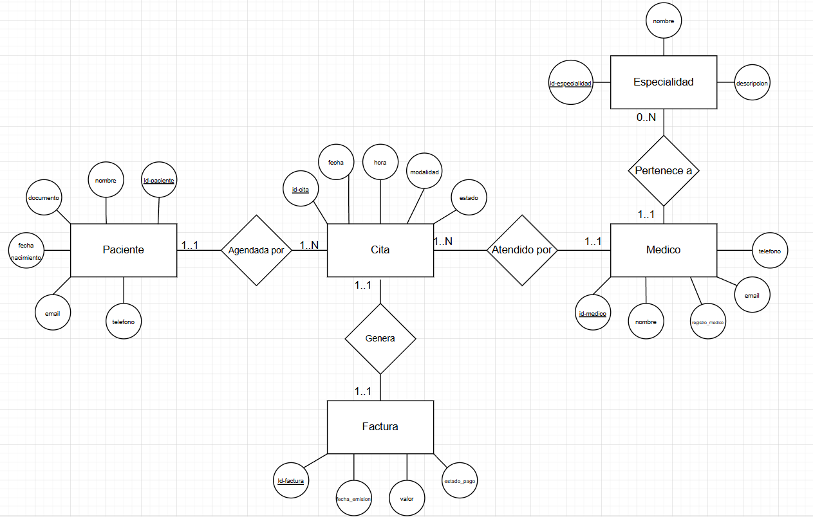

# 🗒️ Registro de Trabajo en Clase - Taller 2

## 📆 Fecha de la sesión
Sábado 14 de febrero de 2026

## 👥 Integrantes presentes
- Deivid Nicolas Urrea Lara
- Samuel Acero García
- Andrés Felipe Azcona

## 🧠 Actividades realizadas en clase

Durante la sesión se trabajó en el modelado conceptual del caso base propuesto (Clínica Salud Viva).

Se discutieron las entidades principales del dominio clínico (Paciente, Cita, Médico, Especialidad y Factura) y las relaciones entre ellas. El equipo analizó cómo representar correctamente las cardinalidades y cómo diferenciar entre modelo conceptual y modelo lógico, evitando el uso de tablas o claves foráneas.

Se decidió utilizar notación conceptual tipo Chen (rectángulos para entidades, rombos para relaciones y cardinalidades min..max). Durante la clase se alcanzó a estructurar el diagrama con entidades, relaciones y cardinalidades, pero sin incluir aún los atributos.

La herramienta utilizada fue draw.io para realizar el boceto digital del modelo.

## 🧩 Boceto inicial del modelo

## 🔁 Tareas definidas para complementar el taller

| Tarea asignada                                                                 | Responsable                                | Fecha estimada |
|---------------------------------------------------------------------------------|--------------------------------------------|----------------|
| Completar atributos del modelo ER y realizar el modelo para el caso real      | Deivid Nicolas Urrea Lara - Samuel Acero Garcia                  | 18/02/2026     |
| Redacción del informe y referencias                                            | Andrés Felipe Azcona - Deivid Nicolas Urrea Lara | 19/02/2026     |
| Revisión general de los modelos, validación final de coherencia y finalizacion del informe              | Samuel Acero García                        | 20/02/2026     |

---

_Este documento resume el trabajo colaborativo realizado durante la sesión del Taller 2 en el curso AREM - Universidad de La Sabana._
