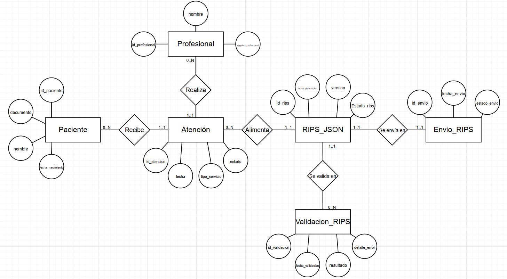

# 📄 Informe Técnico del Taller

## 🔖 Nombre del Taller
Taller 2 - Modelo de Información

## 👥 Integrantes del equipo
- Deivid Nicolas Urrea Lara (GitHub: DNico21)
- Samuel Acero García (GitHub: Iron200044)
- Andrés Felipe Azcona (GitHub: andresazcona)

## 🧠 Descripción general del trabajo
El objetivo del taller fue modelar el dominio de información del cliente real mediante un diagrama Entidad–Relación (ERD) conceptual y un diagrama de contexto ajustado a sus necesidades.

Para el caso real se trabajó con Cemedica IPS, una institución prestadora de servicios de salud ocupacional que enfrenta un cambio regulatorio relacionado con la generación, validación y envío de RIPS en formato JSON hacia la plataforma SISPRO. A partir del proceso modelado previamente en BPMN, se identificaron las entidades de información involucradas y se estructuró un modelo conceptual alineado con el flujo normativo exigido por la regulación vigente.

El enfoque del trabajo no fue técnico (implementación), sino estructural, centrado en cómo se organizan y relacionan los datos dentro del dominio del negocio.

## 🔧 Proceso de desarrollo
El desarrollo del modelo inició con el análisis del proceso BPMN previamente elaborado para la generación y envío de RIPS JSON. A partir de este flujo se identificaron los objetos de información clave: Atención, RIPS_JSON, Envio_RIPS y Validacion_RIPS.

Posteriormente se definieron las entidades principales del dominio clínico (Paciente y Profesional) y se establecieron sus relaciones con la entidad Atención. Luego se modeló la estructura regulatoria incorporando las entidades RIPS_JSON, Envio_RIPS y Validacion_RIPS, reflejando explícitamente el proceso de validación y reprocesamiento en caso de errores.

Se utilizó draw.io para la construcción del modelo conceptual bajo notación Chen (entidades en rectángulos, relaciones en rombos y atributos en óvalos), evitando mezclar notación lógica o física. Se agregaron cardinalidades (min..max) para representar correctamente la participación de cada entidad en las relaciones.

El modelo fue ajustado iterativamente hasta garantizar coherencia entre:
- El proceso BPMN
- El problema normativo
- La estructura de información del cliente

## 🧩 Análisis del modelo propuesto

### Estructura del modelo
El modelo se compone de las siguientes entidades principales:

- Paciente
- Profesional
- Atención
- RIPS_JSON
- Envio_RIPS
- Validacion_RIPS

Las relaciones representan:
- La prestación del servicio médico (Paciente–Atención–Profesional).
- La construcción del archivo RIPS a partir de múltiples atenciones.
- El envío del RIPS a la plataforma externa.
- La validación y posible reprocesamiento del archivo en caso de rechazo.

### Representación de las necesidades del cliente
El modelo refleja directamente el problema regulatorio que enfrenta Cemedica:

- Permite estructurar la generación de RIPS como una entidad independiente.
- Modela la validación como un proceso repetible (0..N validaciones).
- Separa claramente el envío del archivo del resultado de validación.
- Representa la trazabilidad del proceso normativo.

Esto permite visualizar cómo el sistema legacy puede extenderse sin necesidad de una migración completa, facilitando la interoperabilidad con SISPRO.

### Supuestos tomados
- Cada atención pertenece a un único paciente y es realizada por un único profesional.
- Un RIPS_JSON agrupa múltiples atenciones.
- Cada RIPS se envía en un único envío.
- Un RIPS puede validarse múltiples veces en caso de reprocesamiento.
- No se modelaron sistemas tecnológicos (EGMH, SISPRO) como entidades, ya que el enfoque es conceptual y orientado al dominio de negocio.

## 📈 Diagrama final entregado

## 📋 Tabla de actores, entidades o componentes

| Nombre del elemento | Tipo       | Descripción                                                                 | Responsable |
|---------------------|-----------|-----------------------------------------------------------------------------|-------------|
| Paciente            | Entidad   | Persona que recibe el servicio de salud ocupacional                        | IPS         |
| Profesional         | Entidad   | Personal médico que realiza la atención                                    | IPS         |
| Atención            | Entidad   | Registro de la prestación de un servicio médico                            | IPS         |
| RIPS_JSON           | Entidad   | Archivo estructurado exigido por normativa para reporte a SISPRO           | Sistema     |
| Envio_RIPS          | Entidad   | Registro del envío del archivo RIPS hacia la plataforma externa            | Sistema     |
| Validacion_RIPS     | Entidad   | Resultado de validaciones técnicas realizadas sobre el archivo RIPS        | Plataforma externa |

## 🔍 Investigación complementaria

### Tema investigado:
Modelado conceptual de datos en entornos regulados y buenas prácticas en diseño de ERD para interoperabilidad en salud.

### Resumen:
El modelado conceptual de datos es fundamental en organizaciones del sector salud debido a los constantes cambios regulatorios y la necesidad de interoperabilidad entre sistemas heterogéneos. Según Chen (1976), el modelo entidad–relación permite representar de manera estructural los elementos del dominio sin depender de tecnologías específicas.

En el contexto del sector salud, los modelos ERD deben considerar trazabilidad, integridad y control de versiones, especialmente cuando existen procesos de validación externa como en el caso de los RIPS. Modelar explícitamente entidades como Validacion y Envio permite capturar el comportamiento dinámico del sistema sin entrar en detalles técnicos de implementación.

Este enfoque es consistente con principios de Arquitectura Empresarial, donde el modelo de información debe reflejar el negocio y no la solución tecnológica.

## 📚 Referencias
- [1] Chen, P. P.-S. (1976). *The Entity-Relationship Model—Toward a Unified View of Data*. ACM Transactions on Database Systems.
- [2] Ministerio de Salud y Protección Social de Colombia. Resolución 2275 de 2023.
- [3] Ministerio de Salud y Protección Social de Colombia. Resolución 558 de 2024.
- [4] OMG. BPMN Specification. https://www.omg.org/spec/BPMN/

---

_Este documento hace parte de la entrega del Taller 2 del curso AREM (Arquitectura Empresarial) - Universidad de La Sabana._